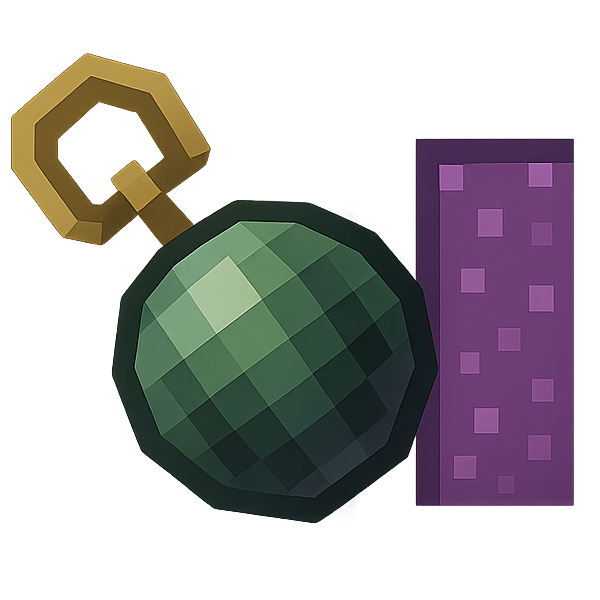
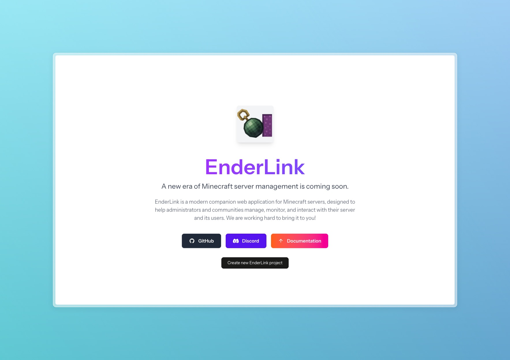
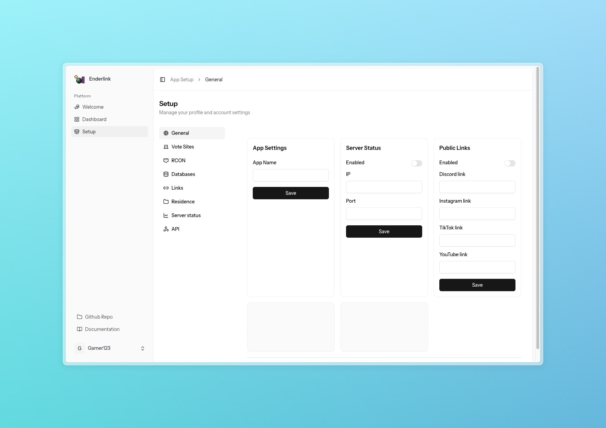

# EnderLink

**EnderLink** is a modern companion web application for Minecraft servers, designed to help server administrators and communities manage, monitor, and interact with their server and its users. Built with Laravel, Vue 3, and Inertia.js, EnderLink provides a sleek, responsive interface and a robust backend for seamless server management.

> **EnderLink will be available as both a self-hosted solution and a cloud-hosted multitenant service.**



---

## Community & Demo

- **Discord:** [Join our Discord](https://discord.gg/uTnaQrCrK6) for support, updates, and community chat.
- **Demo:** [Live Demo](https://enderlink.minebook.eu) (deployed main branch) to explore the features of EnderLink.
- **Hosting:** Use EnderLink as a self-hosted app or as a managed cloud-hosted multitenant project (details coming soon).

---






## Features

- **Dashboard:**
  Overview of server status, quick links, and essential metrics.

- **Public Links:**
  Share Discord, Instagram, TikTok, YouTube, and other community links.

- **Server Status:**
  Live server status monitoring (IP, port, online/offline, etc.).

- **Responsive UI:**
  Clean, modern interface with dark mode support.

- **Multitenancy:**
  Ability to register multiple projects into one hosted instance of EnderLink.

---

## Planned Features

- **User Management:**
  Manage user profiles, authentication, and permissions.

- **Advanced authentication:**
  Support for AuthMe (mc plugin), Discord, Microsoft, and other authentication methods.

- **Server Setup:**
  Configure server settings, RCON, database connections, and integrations.

- **Voting Sites:**
  Add and manage voting sites to boost server popularity.

- **API Integration:**
  Webhook and API endpoints for external integrations.

- **PWA:**
  Progressive Web App support for offline access and mobile-friendly experience.

- **Community Engagement:**
  Forums, announcements, and event management.

- **Customizable Themes:**
  Choose from various themes or create your own for a personalized look.

- **Advanced Analytics:**
  Player statistics, server performance charts, and activity logs.

- **Plugin Management:**
  Install, update, and configure Minecraft plugins directly from the panel.

- **Automated Backups:**
  Schedule and manage server backups.

- **Notifications:**
  In-app and email notifications for important events.

- **Role-Based Access Control:**
  Fine-grained permissions for staff and moderators.

- **Multi-Server Support:**
  Manage multiple Minecraft servers from a single dashboard.

- **Customizable Widgets:**
  Personalize the dashboard with widgets and quick actions.

- **Localization:**
  Support for multiple languages to cater to a global audience.

- **SEO Optimization:**
  Built-in SEO tools for better visibility and search rankings.

- **Mobile App:**
  Companion mobile app for on-the-go management.

---

## Getting Started

### Prerequisites

- PHP 8.4+
- Node.js & npm
- Composer
- SQLite (default) or other supported database

### Installation

1. **Clone the repository:**
   ```sh
   git clone https://github.com/filasik/enderlink.git
   cd enderlink
   ```

2. **Install PHP dependencies:**
   ```sh
   composer install
   ```

3. **Install JavaScript dependencies:**
   ```sh
   npm install
   ```

4. **Set up the environment file:**
   ```sh
   cp .env.example .env
   ```

5. **Generate the application key:**
   ```sh
   php artisan key:generate
   ```

6. **Run the database migrations:**
   ```sh
   php artisan migrate
   ```

7. **Start the development server:**
   ```sh
   php artisan serve
   ```

8. **Compile the assets:**
   ```sh
   npm run dev
   ```

9. **Access the application:**
   Open your web browser and navigate to `http://localhost:8000`.

---

## Contributing

We welcome contributions to EnderLink! To contribute, please follow these steps:

1. Fork the repository on GitHub.
2. Create a new branch for your feature or bugfix.
3. Make your changes and commit them with descriptive messages.
4. Push your branch to your forked repository.
5. Submit a pull request to the main repository.

Please ensure your code adheres to the existing style and conventions used in the project. Also, update the documentation as needed.

---

## License

EnderLink is open-source software licensed under the MIT License. See the `LICENSE` file for details.

---

## Acknowledgements

- **Laravel:** The PHP framework for web artisans.
- **Vue.js:** The progressive JavaScript framework.
- **Inertia.js:** The modern monolith for Laravel & Vue.js.
- **Tailwind CSS:** A utility-first CSS framework for creating custom designs.
- **Font Awesome:** The iconic font and CSS toolkit.
- **Google Fonts:** The library of free, open-source fonts.

---

## Support

For support, please open an issue on the GitHub repository or contact the maintainers directly.

---

## Roadmap

The EnderLink team is constantly working on improving the application. Here's a glimpse of our roadmap:

- [ ] Implement advanced analytics and reporting features.
- [ ] Integrate popular Minecraft plugins for easy management.
- [ ] Develop a mobile app for iOS and Android.
- [ ] Expand API capabilities for deeper integrations.
- [ ] Enhance user interface and user experience based on feedback.

---

## Changelog

### [Unreleased]

### [1.0.0] - WIP

- Initial release of EnderLink.
- Core features implemented: user management, server setup, voting sites, public links, server status, API integration, responsive UI.
- Planned features outlined for future releases.